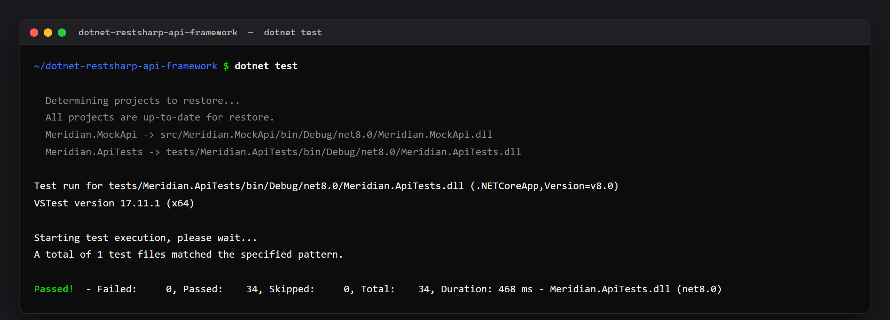

# Meridian API Tests — C# / xUnit / RestSharp

An API test suite for an order capture, four-eyes approval and FX reference-data service.

This is a reference implementation of how I structure API automation: typed clients over RestSharp, contract DTOs owned by the tests rather than shared with the service, data builders, tiered suites for CI, and negative paths treated as first-class rather than an afterthought.

**It runs offline.** The service under test ships with the solution and is started in-process on an ephemeral port, so a clean clone goes green with one command — no container to start, no environment to seed, no port collisions on a shared agent.

```bash
dotnet test
```

```
Passed!  -  Failed: 0, Passed: 34, Skipped: 0, Total: 34, Duration: 468 ms
```



---

## Why it is built this way

| Decision | Reason |
|---|---|
| Contract DTOs in `Models/`, not the service's own types | If both sides share one class, a renamed field can never fail a test. These DTOs are the contract the suite defends. |
| `ThrowOnAnyError = false` | A client that throws on non-2xx cannot be used to assert that the API returns `403`. Status codes are data here, not exceptions. |
| Service hosted in-process on an ephemeral port | One command to green, and parallel CI agents cannot collide on a fixed port. |
| `API_BASE_URL` override | The same specs run against a deployed environment with no code change. |
| Builders (`AboveLimit`, `AtLimit`) over shared constants | Each test states only what it cares about; a default change cannot silently invalidate an unrelated assertion. |
| `Category` traits | PR builds run `Category=Smoke`; merge and nightly run everything. |
| `CaptureOrThrowAsync` for setup | Setup that fails must fail loudly with the response body, not surface as a confusing assertion error three lines later. |

## Layout

```
src/Meridian.MockApi/          Service under test (minimal API, no external packages)
  MockApiHost.cs               Host factory - lets the suite start it in-process
tests/Meridian.ApiTests/
  Clients/                     Typed RestSharp clients over the endpoints
  Models/Contracts.cs          The contracts the suite asserts against
  Infrastructure/              Host fixture, collection definition, data builders
  Tests/                       Specs grouped by capability
.github/workflows/api-tests.yml
```

## Running

| Command | Purpose |
|---|---|
| `dotnet test` | Full suite |
| `dotnet test --filter "Category=Smoke"` | The PR gate |
| `dotnet test --filter "Category=Regression"` | Regression tier |
| `dotnet test --filter "FullyQualifiedName~ApprovalWorkflow"` | One capability |
| `dotnet run --project src/Meridian.MockApi` | Start the service alone on :5055 |

Against a deployed environment:

```bash
API_BASE_URL=https://api.staging.example.com dotnet test
```

## Coverage

**Health and reference data** — liveness; FX rates defaulting to a USD base; the base currency not being quoted against itself; every supported base returning strictly positive quotes; case-insensitive base handling; `404` with a machine-readable code for an unsupported currency.

**Authorization** — `401` for a missing key; `401` rather than `403` for an unrecognised key, because an unidentified caller should be told to authenticate, not that they lack permission; a read-only role refused on write but permitted on read; a trader role refused approval rights.

**Order capture** — `201` with the full contract and a `Location` header pointing at the created resource; notional computed as quantity × price; an order **exactly at** the approval threshold passing straight through, since the rule is *above* the limit and an off-by-one here is an approval bypass; above-limit orders held; retrieval by id; `404` for an unknown id; six table-driven invalid payloads each mapped to a specific error code; an unrecognised status filter returning `400` rather than an empty list that would hide a caller's typo.

**Approval workflow** — an independent approver releasing and rejecting; the four-eyes rule refusing the capturing user *even when that user holds the approver role*, so the rule and not the role check is what fires; `409` on a repeated approval, which is what a double submit looks like; a rejected order not being approvable afterwards; an order that never required approval not being approvable; `404` for an unknown order; held orders discoverable through the status filter.

## Test credentials

| API key | Identity | Role |
|---|---|---|
| `trader-key-001` | A. Trader | Captures orders |
| `approver-key-002` | S. Approver | Approves or rejects |
| `readonly-key-003` | R. Viewer | Read-only |

## Business rules under test

- Notional = quantity × price. **Above** 1,000,000 requires approval; at or below is approved on capture.
- An order may not be approved by the user who captured it, regardless of role.
- Only the `approver` role may action approvals.
- An order that has been actioned cannot be actioned again.

---

Built by **Abdul Rahman Nazardeen** — QA automation engineer working on ERP and financial trading systems. [LinkedIn](https://www.linkedin.com/in/abdulrahmaan-nazardeen-a80435106/)
